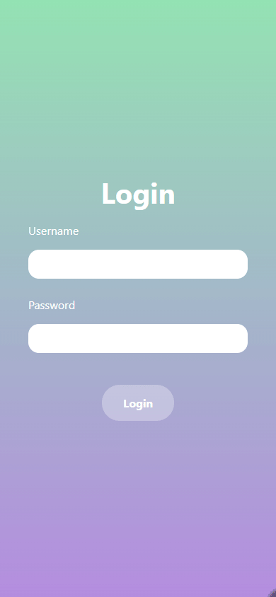

# MooFooLog
An app to track your mood together with the food you ate.
Stores entries in DB and exports them as Excel file.

Contains a Rust backend project and a user interface written in React. It comes with a ready-to-use `prod` docker compose setup. 

<p align="center"></p>

# Workspace
## Build (all)
```bash
$ cargo build --workspace
```

## Docker
In `./docker/dev/`:
```bash
$ docker compose up -d postgres
```

## Build
```bash
$ cargo build
```

## Run
Run with default profile
```bash
$ cargo run
```
Run with dev profile
```bash
$ cargo run -- --config=config/dev.yml
```

# Backend
## Docker
In `./docker/dev/`:
```bash
$ docker compose up -d postgres
```


## Docker Image
In `./` (project root):
```bash
$ docker build -t moofoolog:linux -f ./docker/moofoolog/Dockerfile .
```

## Running with Compose
First, create the required DB volume. (It is defined as "external" to prevent it from beeing deleted by `docker compose down`).
```bash
$ docker colume create postgres_data_moofoolog
```

In `./docker/prod/`:
```bash
$ docker compose up -d
```

## Exporting Docker image to other server
In `./docker/prod/`:
```bash
$ docker save -o moofoolog-prod.tar moofoolog-prod:latest
```

--> creates a tar file which can be copied to server, there load it via:

```bash
$ docker load -i moofoolog-prod.tar
```

# Frontend
Prepare and run UI:
```bash
$ npm install
$ npm run dev
```

Build to `/dist` folder:
```bash
$ npm run build
```
